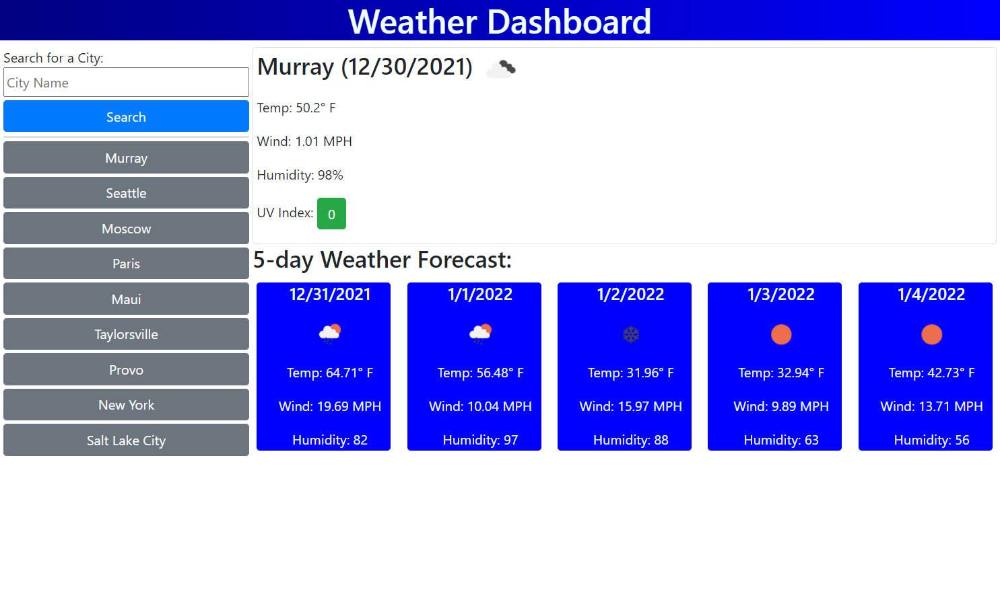

# Weather Dashboard
  
Know what the weather will be before you go!  
  

  

## Description

Bad weather can impact any plans. This project allows the user to know in advance what kind of weather to expect in any of 200,000 cities across the world thanks to the openweathermap api so that they can make or change their plans accordingly.

## Made with:

- HTML
- CSS
- Javascript
- jQuery
- Bootstrap

## Website

https://dhalladay.github.io/travel-weather-dashboard/

## Usage

Type the city you would like to search into the city search and press the search button. 
  
If you would like to see a previous city, simply click on the button with that cities name. 

## Credits

* created by: Dave Halladay
